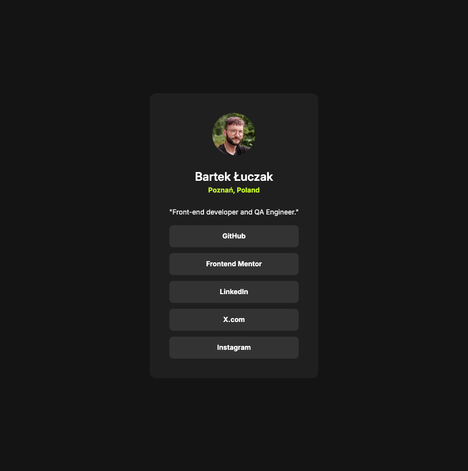

# Frontend Mentor - Social links profile solution

This is a solution to the [Social links profile challenge on Frontend Mentor](https://www.frontendmentor.io/challenges/social-links-profile-UG32l9m6dQ). Frontend Mentor challenges help you improve your coding skills by building realistic projects.

## Table of contents

- [Overview](#overview)
  - [The challenge](#the-challenge)
  - [Screenshot](#screenshot)
  - [Links](#links)
- [My process](#my-process)
  - [Built with](#built-with)
  - [What I learned](#what-i-learned)
- [Author](#author)

## Overview

### The challenge

Challenge is to build out this social links profile and get it looking as close to the design as possible.

Ensure that visitors can navigate the site using only the keyboard.

### Screenshot

### Links

- Solution URL: [Add solution URL here](https://github.com/bartekluczak/social-links-profile)
- Live Site URL: [Add live site URL here](https://bartekluczaklinks.netlify.app)

## My process

### Built with

- Semantic HTML5 markup
- CSS custom properties
- Flexbox

### What I learned

1. Enable users to navigate using the keyboard
2. Increase knowledge of Flexbox
3. Define custom CSS variables

## Author

- Github - [Bartek Łuczak](https://github.com/bartekluczak)
- Frontend Mentor - [@bartekluczak](https://www.frontendmentor.io/profile/bartekluczak)
